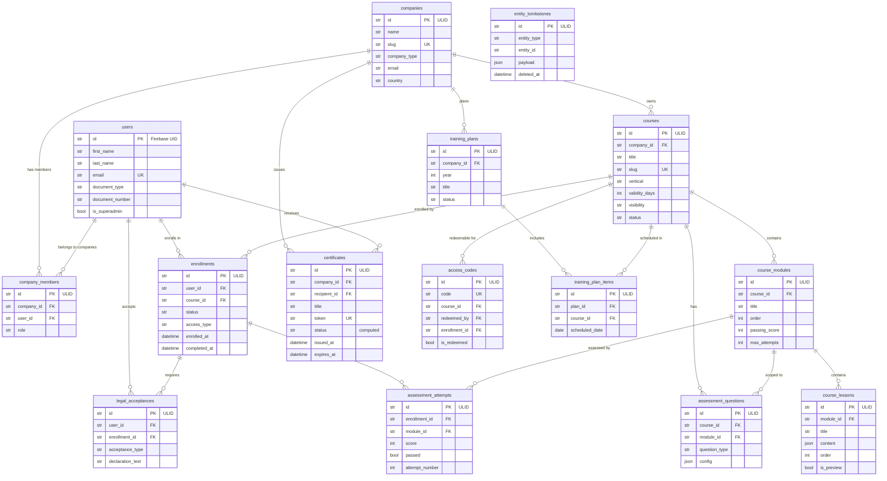

# Database Relationships Diagram

All relationships are enforced at the **application layer** (no FK constraints in DB).
Arrows show logical references: `child.field` -> `parent.table`.

## Entity Relationship Diagram (Mermaid)



---

## Relationship Summary Table

| Parent | Child | Join | Cardinality | Notes |
|--------|-------|------|-------------|-------|
| `companies` | `company_members` | `company_members.company_id = companies.id` | 1:N | UNIQUE(company_id, user_id) |
| `users` | `company_members` | `company_members.user_id = users.id` | 1:N | Same row, double reference |
| `companies` | `courses` | `courses.company_id = companies.id` | 1:N | Tenant-scoped catalog |
| `courses` | `course_modules` | `course_modules.course_id = courses.id` | 1:N | Ordered by `order` |
| `course_modules` | `course_lessons` | `course_lessons.module_id = course_modules.id` | 1:N | Ordered by `order` |
| `users` | `enrollments` | `enrollments.user_id = users.id` | 1:N | |
| `courses` | `enrollments` | `enrollments.course_id = courses.id` | 1:N | UNIQUE(user_id, course_id) |
| `enrollments` | `assessment_attempts` | `assessment_attempts.enrollment_id = enrollments.id` | 1:N | |
| `course_modules` | `assessment_attempts` | `assessment_attempts.module_id = course_modules.id` | 1:N | Nullable (legacy) |
| `courses` | `assessment_questions` | `assessment_questions.course_id = courses.id` | 1:N | |
| `course_modules` | `assessment_questions` | `assessment_questions.module_id = course_modules.id` | 1:N | Nullable |
| `companies` | `certificates` | `certificates.company_id = companies.id` | 1:N | Tenant-scoped |
| `users` | `certificates` | `certificates.recipient_id = users.id` | 1:N | |
| `courses` | `access_codes` | `access_codes.course_id = courses.id` | 1:N | |
| `users` | `access_codes` | `access_codes.redeemed_by = users.id` | 1:N | Nullable |
| `enrollments` | `access_codes` | `access_codes.enrollment_id = enrollments.id` | 1:1 | Created on redemption |
| `companies` | `training_plans` | `training_plans.company_id = companies.id` | 1:N | |
| `training_plans` | `training_plan_items` | `training_plan_items.plan_id = training_plans.id` | 1:N | |
| `courses` | `training_plan_items` | `training_plan_items.course_id = courses.id` | 1:N | |
| `users` | `legal_acceptances` | `legal_acceptances.user_id = users.id` | 1:N | |
| `enrollments` | `legal_acceptances` | `legal_acceptances.enrollment_id = enrollments.id` | 1:N | |

---

## Key Design Decisions

### Why no FK constraints?

1. **Cross-domain independence** — each domain owns its tables and can be deployed/migrated independently
2. **Soft-coupled via ULID references** — referential integrity enforced at the application layer (use cases validate existence before writes)
3. **Hard delete + tombstone** — deleted entities leave a JSON snapshot in `entity_tombstones`, no cascading deletes needed
4. **Firebase UID as user ID** — `users.id` is a Firebase UID (not ULID), making it awkward for standard FK constraints

### Scalability considerations

| Aspect | Current design | Risk | Mitigation |
|--------|---------------|------|------------|
| **Tenant isolation** | `company_id` column + app-level filtering | Query without `company_id` returns cross-tenant data | Always include `company_id` in WHERE; add composite indexes if needed |
| **JSON columns** | `content`, `config`, `answers` | Not queryable by default | Only used for display/snapshot, never for filtering |
| **No cascading deletes** | Tombstone pattern | Orphaned rows possible if app bug | Periodic cleanup scripts; tombstone gives audit trail |
| **Single enrollments table** | All enrollment types in one table | High write volume per course launch | Indexed on `(user_id, course_id)`; partitioning not needed yet |
| **Assessment attempts** | Append-only | Grows linearly with usage | Indexed on `enrollment_id`; archive old attempts if needed |

### Entity count: 16 tables

```
Core:        users, companies, company_members (3)
Education:   courses, course_modules, course_lessons,
             enrollments, assessment_questions, assessment_attempts,
             access_codes, training_plans, training_plan_items (9)
Cert:        certificates (1)
Legal:       legal_acceptances (1)
System:      entity_tombstones (1)
IAM:         roles live in company_members.role (no separate table)
```
